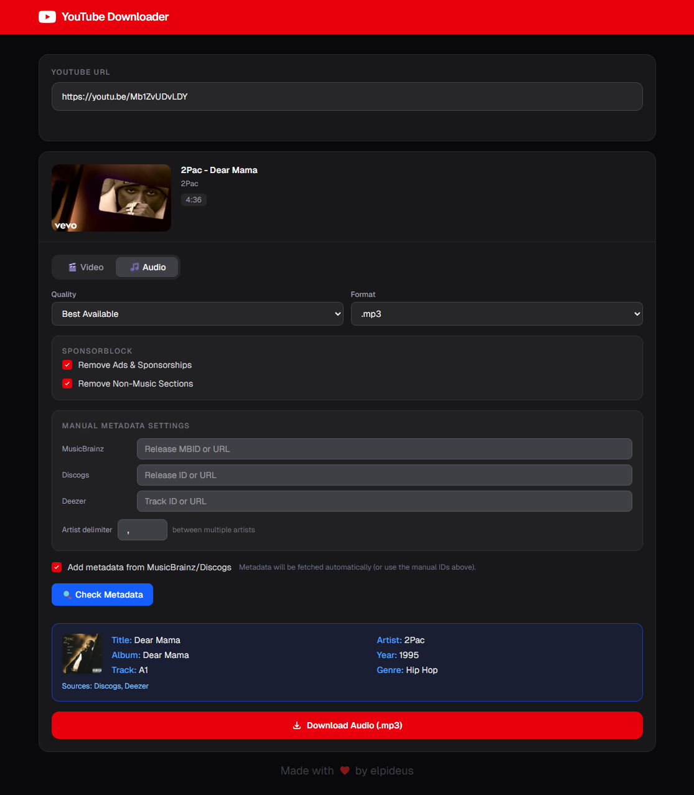

# 🎥 YouTube Downloader

A professional, feature-rich web application for downloading YouTube videos and playlists in high quality. Built with **Next.js**, **yt-dlp**, and **FFmpeg**, it features automatic metadata tagging from **MusicBrainz**, **Discogs**, and **Deezer**.



## ✨ Features

-   **High Quality Downloads**: Support for various video (MP4, MKV, WebM) and audio (MP3, M4A, FLAC, WAV, OGG) formats.
-   **Playlist Support**: Download entire playlists as a single ZIP file or individual tracks.
-   **Automatic Metadata**: Fetches album art, artist, album, and track information using:
    -   [MusicBrainz](https://musicbrainz.org)
    -   [Discogs](https://discogs.com)
    -   [Deezer](https://deezer.com)
-   **SponsorBlock Integration**: Automatically remove sponsorships, intros, outros, and non-music sections.
-   **Smart Caching**: Uses Prisma and SQLite to cache metadata lookups for faster subsequent requests.
-   **Premium UI**: Sleek, responsive design with dark mode support and real-time progress updates.
-   **Docker Ready**: Easy deployment using Docker and Docker Compose.

## 🛠️ Tech Stack

-   **Frontend**: [Next.js](https://nextjs.org) 15+, [React](https://react.dev)
-   **Backend**: [Next.js API Routes](https://nextjs.org/docs/pages/building-your-application/routing/api-routes) ([Node.js](https://nodejs.org))
-   **Database**: [SQLite](https://sqlite.org) with [Prisma ORM](https://prisma.io)
-   **Downloader**: [yt-dlp](https://github.com/yt-dlp/yt-dlp)
-   **Media Processing**: [FFmpeg](https://ffmpeg.org/)
-   **Styling**: [Tailwind](https://tailwindcss.com)

## 🚀 Getting Started

### Prerequisites

-   [Docker](https://docker.com) and [Docker Compose](https://docs.docker.com/compose/)
-   (Optional) [Node.js](https://nodejs.org) 20+ if running locally without Docker

### Quick Start (Docker)

1.  Create a directory for your data and start the container:
    ```bash
    mkdir -p data
    docker run -d \
      -p 3000:3000 \
      -v $(pwd)/data:/app/data \
      --name youtube-downloader \
      ghcr.io/elpideus/youtube-downloader:latest
    ```

The app will be available at `http://localhost:3000`.

## ⚙️ Configuration

The following environment variables can be configured in `.env`:

| Variable | Description | Default |
| :--- | :--- | :--- |
| `DATABASE_URL` | SQLite connection string | Required (`file:./data/ytdl.db`) |
| `FFMPEG_LOCATION` | Path to FFmpeg binaries (if not in PATH) | Optional |
| `YTDLP_PATH` | Path to yt-dlp binary (if not in PATH) | `yt-dlp` |
| `DISCOGS_TOKEN` | Discogs API token for metadata | Optional |
| `DEEZER_API_KEY` | Deezer API access token | Optional |
| `DEBUG` | Enable verbose server logging | `false` |

## 📦 Development

Running locally with Node:

```bash
# Install dependencies
npm install

# Push database schema
npx prisma db push

# Run development server
npm run dev
```

## 📜 License

This project is licensed under the GPLv3 License - see the [LICENSE](LICENSE) file for details.

## 🤝 Contributing

Contributions are welcome! Please feel free to submit a Pull Request.

---
Made with ❤️ by elpideus